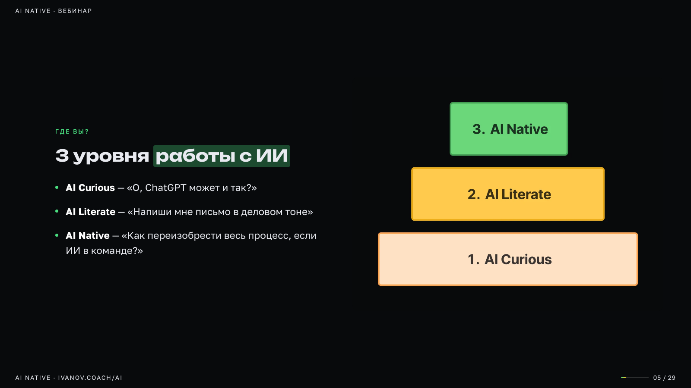

# slides-generator — Claude Code skill

A [Claude Code](https://claude.ai/code) skill that turns a Markdown file into a self-contained, single-file HTML slide deck.

**Dark minimal style** · a meaning-matched animated SVG illustration on every slide (134 motifs + 25 icons) · 6 color themes, 8 font pairs · 6 structure presets (webinar, pitch, report, workshop, strategy, course) · keyboard navigation · speaker notes & presenter view · autoplay



---

## What it does

- Reads a `.md` file with session content
- Assigns a layout and animated SVG illustration to every slide based on meaning
- Outputs one `.html` file — no build step, no dependencies, open in any browser
- Also saves a clean `.md` copy of the slides and updates a `slides-index.html` navigator

> The agent instructions (`SKILL.md`) are written in Russian; Claude follows them fine and the decks can be in any language.

---

## Install

```bash
git clone --depth 1 https://github.com/alexivanovvv/turboskills /tmp/turboskills
cp -r /tmp/turboskills/create/slides-generator ~/.claude/skills/
```

Then restart Claude Code (or open a new session) — `/slides-generator` appears in the command list.

---

## Requirements

| What | Needed for | Required? |
|------|-----------|-----------|
| Claude Code | everything | yes |
| Python 3.8+ (standard library only) | settings page, `lint.py`, `validate.py`, `rebuild.py` | recommended |
| Google Chrome or Chromium | post-build screenshot check, `lint.py`, PDF/PNG export (`export.sh`), `publish.py` | optional — found automatically on macOS / Windows / Linux, or set `$CHROME` |
| [Netlify CLI](https://docs.netlify.com/cli/get-started/) (logged in) + `pip install qrcode pillow` | `publish` — public deck page with QR code and handout PDF | optional |

Without Chrome the deck is still generated — only the screenshot self-check and exports are skipped.

---

## Configuration

`/slides-generator config` opens a local settings page (`http://127.0.0.1:7361/`) that edits `config.json`: theme, fonts, layouts, motifs, image handling, deck gallery.

Two keys you may want to set by hand in `config.json`:

```json
"decksDir": "~/Documents/Presentations",
"publish": { "site": "my-netlify-site", "baseUrl": "https://my-netlify-site.netlify.app", "siteName": "Your Name", "locale": "en_US" }
```

- `decksDir` — where the **Decks** tab looks for generated decks (default: the folder you launched `settings.py` from).
- `publish` — only for `/slides-generator publish <deck.html> --deploy`.

---

## Usage

In any Claude Code conversation:

```
/slides-generator path/to/content.md
/slides-generator path/to/content.md --ratio 16:9
```

The skill generates slides alongside your source file:

```
2024-06-11 - Slides My Session/
  My Session — Slides Content.html   ← open this in a browser
  My Session — Slides Content.md     ← clean markdown copy
```

---

## Content format

A flat Markdown file, one section per slide. Use `---` to separate slides:

```markdown
# Session Title
Brand Name · Date · Author

---

## Slide Title

- Bullet point one
- Bullet point two with **bold**

---

## Another Slide

- Item
```

The skill infers layout from content: text-heavy → left/right 50/50; grids/steps → full-width with numcards; dividers → section headers. See `SKILL.md` for the full component library.

---

## Navigation (keyboard)

| Key | Action |
|-----|--------|
| `→` | Next slide |
| `←` | Previous slide |
| `Ctrl+N` | Toggle speaker notes |
| `Ctrl+F` | Fullscreen |
| `Ctrl+P` | Presenter view (current + next slide, notes, timer) |
| `Ctrl+K` | Slide comments |
| `Ctrl+B` / `Ctrl+E` | First / last slide |
| `AUTOPLAY ›` button | Auto-advance every 20 s |
| `FAST PLAY ››` button | Auto-advance every 7 s |

---

## Customising the template

`template.html` is the single source of truth. It contains:

- CSS custom properties (`:root`) for colors, fonts, spacing
- 134 `<symbol>` SVG motifs + 25 icons — add your own in the same `420×560` canvas style
- JS for navigation, autoplay, speaker notes, fullscreen

**Color palette** — 6 accent variables, all configurable:
```css
--green: #4ade80   /* primary accent */
--amber: #fbbf24   /* secondary accent */
--blue:  #38bdf8
--violet:#c084fc
--pink:  #f472b6
--orange:#fb923c
```

**Fonts** — three Google Fonts families with full Cyrillic support:
- `Unbounded` — display headings (h1, section titles)
- `Manrope` — subheadings (h2, kickers)
- `Golos Text` — body text

Change the `@import` line and `:root` font variables to use different fonts.

---

## Components

Full reference in `SKILL.md`. Quick overview:

| Component | Use |
|-----------|-----|
| `h2 + ul` | Standard bullet slide (50/50 with art) |
| `.slide.wide` | Full-width slide, no art |
| `.pgrid.row4` | 4-column numcard grid |
| `.cards.g5` | 5-column numcard row |
| `.hexring` | 6 items on a ring with animated center |
| `.arc` | Two-column comparison (Bad/Good) |
| `.bq` | Block quote — italic Lora + left border |
| `.sec-title` | Section divider slide |
| `.qa-big` | Q&A closing slide |

---

## Files

| File | Purpose |
|------|---------|
| `template.html` | CSS + JS + SVG library + `<!-- SLIDES_PLACEHOLDER -->` |
| `SKILL.md` | Instructions for the Claude agent |
| `VISUALIZATIONS.md` | SVG motif catalogue — which motif fits which meaning |
| `config.json` | Default settings (edited via the settings page) |
| `settings.py` / `settings.html` | Local settings page + deck gallery (`/slides-generator config`) |
| `rebuild.py` | Re-apply the current template/config to an existing deck |
| `lint.py` / `validate.py` | Overflow/tiny-text checks (headless Chrome) and HTML↔MD sync check |
| `export.sh` | PDF / PNG export via headless Chrome |
| `publish.py` | Public deck page with QR, handout PDF, OG tags; optional Netlify deploy |
| `ROADMAP.md` | Ideas for future improvements |

---

## License

MIT
