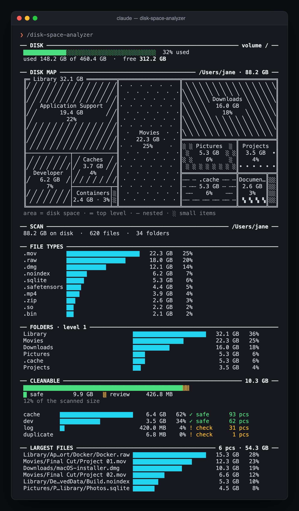
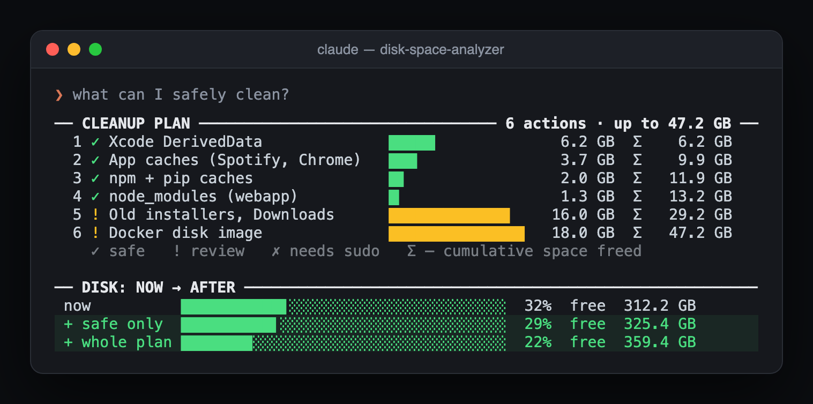
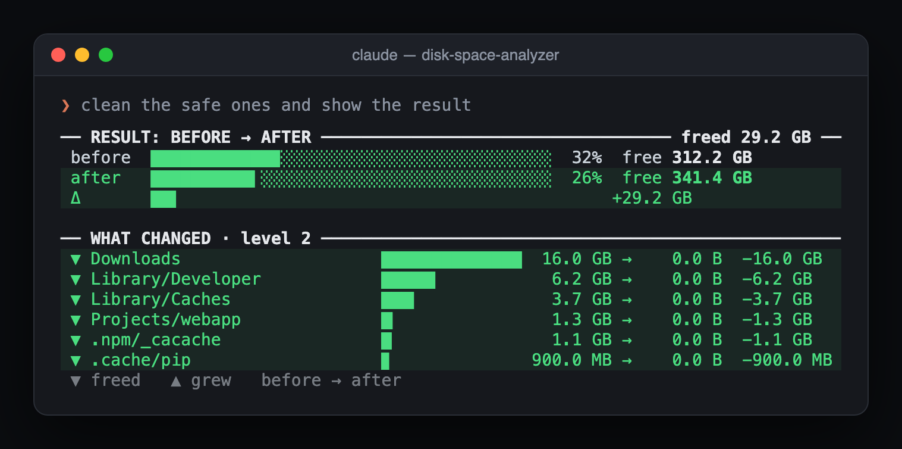

# disk-space-analyzer – Claude Code skill

A [Claude Code](https://claude.ai/code) skill that finds out what's eating your disk, proposes a safe cleanup and **shows everything as charts right in the terminal**: a disk map, bar charts, a cleanup plan and a before → after result.

It works on **macOS** (no extra tools) and **Windows** (via the free [WizTree](https://diskanalyzer.com/)). Scripts use only the Python standard library, and they only read the disk. The agent deletes things itself, and only after you confirm.

---

## What it does

- **Scans** your home folder (or any path or volume) and records the real on-disk size of every file. Cloud-only placeholders from iCloud, Dropbox or Google Drive are counted separately, because they use no disk space
- **Draws a disk map**: a treemap made of box-drawing characters, with nested rectangles and a different hatch for every folder
- **Charts** the largest folders, file types and files, plus what can be cleaned
- **Sorts cleanup candidates** into caches, logs, temp files, dev artifacts (`node_modules`, `__pycache__`, DerivedData), backups and duplicates. Each one gets a safety level: ✓ safe, ! check first, or ✗ needs admin
- **Proposes a cleanup plan** as a chart: ranked actions, cumulative space freed (Σ) and disk gauges for now → safe only → whole plan
- **Proves the result**: after cleanup it rescans and draws before → after, including what changed in every folder
- **Uses color in chat**: lines showing the cleanup effect are green (Claude Code renders them inside a `diff` block). Nothing is red
- **Suggests cache migration** (npm, pip, uv, HuggingFace, Docker) when moving a cache to another drive is better than deleting it

## How it looks

These screenshots come from a demo scan with made-up folders.

### Dashboard: disk gauge, disk map and bar charts



### Cleanup plan



### After cleanup: before → after



<details>
<summary>Same charts as text (exactly what Claude Code prints)</summary>

```diff
 ── DISK ────────────────────────────────────────────────────────── volume / ──
  ████████████▉░░░░░░░░░░░░░░░░░░░░░░░░░░░  32% used
  used 148.2 GB of 460.4 GB  ·  free 312.2 GB
 
 ── DISK MAP ───────────────────────────────────────── /Users/jane · 88.2 GB ──
  ╔═ Library 32.1 GB ═════════╦══════════════════╦════════════════════════════╗
  ║╱ ╱ ╱ ╱ ╱ ╱ ╱ ╱ ╱ ╱ ╱ ╱ ╱ ╱║·  ·  ·  ·  ·  ·  ║ ╲ ╲ ╲ ╲ ╲ ╲ ╲ ╲ ╲ ╲ ╲ ╲ ╲ ╲║
  ║ ╱ ╱ ╱ ╱ ╱ ╱ ╱ ╱ ╱ ╱ ╱ ╱ ╱ ║  ·  ·  ·  ·  ·  ·║╲ ╲ ╲ ╲ ╲ ╲ ╲ ╲ ╲ ╲ ╲ ╲ ╲ ╲ ║
  ║╱ ╱ ╱ ╱ ╱ ╱ ╱ ╱ ╱ ╱ ╱ ╱ ╱ ╱║ ·  ·  ·  ·  ·  · ║ ╲ ╲ ╲ ╲ Downloads ╲ ╲ ╲ ╲ ╲║
  ║ ╱  Application Support  ╱ ║·  ·  ·  ·  ·  ·  ║╲ ╲ ╲ ╲   16.0 GB   ╲ ╲ ╲ ╲ ║
  ║╱ ╱       19.4 GB       ╱ ╱║  ·  ·  ·  ·  ·  ·║ ╲ ╲ ╲ ╲    18%    ╲ ╲ ╲ ╲ ╲║
  ║ ╱          22%          ╱ ║ ·  ·  ·  ·  ·  · ║╲ ╲ ╲ ╲ ╲ ╲ ╲ ╲ ╲ ╲ ╲ ╲ ╲ ╲ ║
  ║╱ ╱ ╱ ╱ ╱ ╱ ╱ ╱ ╱ ╱ ╱ ╱ ╱ ╱║·  ·  ·  ·  ·  ·  ║ ╲ ╲ ╲ ╲ ╲ ╲ ╲ ╲ ╲ ╲ ╲ ╲ ╲ ╲║
  ║ ╱ ╱ ╱ ╱ ╱ ╱ ╱ ╱ ╱ ╱ ╱ ╱ ╱ ║  ·   Movies  ·  ·║╲ ╲ ╲ ╲ ╲ ╲ ╲ ╲ ╲ ╲ ╲ ╲ ╲ ╲ ║
  ║╱ ╱ ╱ ╱ ╱ ╱ ╱ ╱ ╱ ╱ ╱ ╱ ╱ ╱║ ·   22.3 GB ·  · ╠════════════════╦═══════════╣
  ║ ╱ ╱ ╱ ╱ ╱ ╱ ╱ ╱ ╱ ╱ ╱ ╱ ╱ ║·  ·   25%     ·  ║░ ░ Pictures  ░ ║ Projects  ║
  ╟─────────────┬─────────────╢  ·  ·  ·  ·  ·  ·║ ░   5.3 GB  ░ ░║  3.5 GB  ∙║
  ║ ╱ ╱ ╱ ╱ ╱ ╱ │ ╱ Caches  ╱ ║ ·  ·  ·  ·  ·  · ║░ ░    6%     ░ ║    4%     ║
  ║╱ ╱ ╱ ╱ ╱ ╱ ╱│╱  3.7 GB ╱ ╱║·  ·  ·  ·  ·  ·  ║ ░ ░ ░ ░ ░ ░ ░ ░║∙ ∙ ∙ ∙ ∙ ∙║
  ║  Developer  │ ╱   4%    ╱ ║  ·  ·  ·  ·  ·  ·╠════════════════╬════════╦══╣
  ║╱   6.2 GB  ╱│╱ ╱ ╱ ╱ ╱ ╱ ╱║ ·  ·  ·  ·  ·  · ║┄┄ ┄ .cache ┄┄ ┄║Documen…║░░║
  ║      7%     ├───────────┬─╢·  ·  ·  ·  ·  ·  ║┄ ┄┄ 5.3 GB ┄ ┄┄║ 2.6 GB ║░░║
  ║╱ ╱ ╱ ╱ ╱ ╱ ╱│ Containers│░║  ·  ·  ·  ·  ·  ·║ ┄┄    6%    ┄┄ ║   3%   ║░░║
  ║ ╱ ╱ ╱ ╱ ╱ ╱ │2.4 GB · 3%│░║ ·  ·  ·  ·  ·  · ║┄┄ ┄┄ ┄┄ ┄┄ ┄┄ ┄║ ▚ ▚ ▚ ▚║░░║
  ╚═════════════╧═══════════╧═╩══════════════════╩════════════════╩════════╩══╝
  area = disk space · ═ top level · ─ nested · ░ small items
 
 ── SCAN ─────────────────────────────────────────────────────── /Users/jane ──
  88.2 GB on disk  ·  620 files  ·  34 folders
 
 ── FILE TYPES ────────────────────────────────────────────────────────────────
  .mov         ██████████████████████   22.3 GB   25%
  .raw         █████████████████▊       18.0 GB   20%
  .dmg         ███████████▉             12.1 GB   14%
  .noindex     ██████▏                   6.2 GB    7%
  .sqlite      █████▎                    5.3 GB    6%
  .safetensors ████▍                     4.4 GB    5%
  .mp4         ███▉                      3.9 GB    4%
  .zip         ██▋                       2.6 GB    3%
  .so          ██▏                       2.2 GB    2%
  .bin         ██▏                       2.1 GB    2%
 
 ── FOLDERS · level 1 ─────────────────────────────────────────────────────────
  Library                          ██████████████████████   32.1 GB   36%
  Movies                           ███████████████▎         22.3 GB   25%
  Downloads                        ███████████              16.0 GB   18%
  Pictures                         ███▋                      5.3 GB    6%
  .cache                           ███▋                      5.3 GB    6%
  Projects                         ██▍                       3.5 GB    4%
 
 ── CLEANABLE ────────────────────────────────────────────────────── 10.3 GB ──
  ████████████████████████████████████████████████▒▒
  █ safe         9.9 GB   ▒ review     426.8 MB
  12% of the scanned size
 
  cache      ██████████████████████    6.4 GB   62% ✓ safe      93 pcs
  dev        ████████████▏             3.5 GB   34% ✓ safe      62 pcs
  log        █▍                      420.0 MB    4% ! check     31 pcs
  duplicate                            6.8 MB    0% ! check      1 pcs
 
 ── LARGEST FILES ────────────────────────────────────────── 6 pcs · 54.3 GB ──
  Library/Ap…ort/Docker/Docker.raw ██████████████████████   15.3 GB   28%
  Movies/Final Cut/Project 01.mov  █████████████████▊       12.3 GB   23%
  Downloads/macOS-installer.dmg    ██████████████▊          10.3 GB   19%
  Movies/Final Cut/Project 02.mov  █████████▌                6.6 GB   12%
  Library/De…vedData/Build.noindex ███████▋                  5.3 GB   10%
  Pictures/P…library/Photos.sqlite ██████▌                   4.5 GB    8%
```

```diff
 ── CLEANUP PLAN ───────────────────────────────── 6 actions · up to 47.2 GB ──
   1 ✓ Xcode DerivedData              █████▏             6.2 GB  Σ    6.2 GB
   2 ✓ App caches (Spotify, Chrome)   ███▏               3.7 GB  Σ    9.9 GB
   3 ✓ npm + pip caches               █▋                 2.0 GB  Σ   11.9 GB
   4 ✓ node_modules (webapp)          █▏                 1.3 GB  Σ   13.2 GB
   5 ! Old installers, Downloads      █████████████▍    16.0 GB  Σ   29.2 GB
   6 ! Docker disk image              ███████████████   18.0 GB  Σ   47.2 GB
     ✓ safe   ! review   ✗ needs sudo   Σ — cumulative space freed
 
 ── DISK: NOW → AFTER ─────────────────────────────────────────────────────────
  now          ███████████▋░░░░░░░░░░░░░░░░░░░░░░░░  32%  free  312.2 GB
+ + safe only  ██████████▌░░░░░░░░░░░░░░░░░░░░░░░░░  29%  free  325.4 GB
+ + whole plan ███████▉░░░░░░░░░░░░░░░░░░░░░░░░░░░░  22%  free  359.4 GB
```

```diff
 ── RESULT: BEFORE → AFTER ─────────────────────────────────── freed 29.2 GB ──
  before  ████████████▉░░░░░░░░░░░░░░░░░░░░░░░░░░░  32%  free  312.2 GB
+ after   ██████████▍░░░░░░░░░░░░░░░░░░░░░░░░░░░░░  26%  free  341.4 GB
+ Δ       ██▌                                           +29.2 GB
 
 ── WHAT CHANGED · level 2 ────────────────────────────────────────────────────
+ ▼ Downloads                    ██████████████  16.0 GB →    0.0 B  −16.0 GB
+ ▼ Library/Developer            █████▍           6.2 GB →    0.0 B  −6.2 GB
+ ▼ Library/Caches               ███▎             3.7 GB →    0.0 B  −3.7 GB
+ ▼ Projects/webapp              █▏               1.3 GB →    0.0 B  −1.3 GB
+ ▼ .npm/_cacache                █                1.1 GB →    0.0 B  −1.1 GB
+ ▼ .cache/pip                   ▊              900.0 MB →    0.0 B  −900.0 MB
  ▼ freed   ▲ grew   before → after
```

</details>

## Install

```bash
cp -r tools/disk-space-analyzer ~/.claude/skills/
```

Then in Claude Code:

```
/disk-space-analyzer
```

You can also just ask: "what's taking up space on my disk?", "clean my disk" or "find large files".

## Standalone use (macOS)

```bash
cd tools/disk-space-analyzer
python3 scripts/macos/scan_disk.py ~ /tmp/disk_report.csv            # scan (also saves disk usage to .disk.json)
python3 scripts/macos/analyze_disk.py /tmp/disk_report.csv dashboard  # one-screen overview
python3 scripts/macos/analyze_disk.py /tmp/disk_report.csv plan plan.json
python3 scripts/macos/analyze_disk.py /tmp/after.csv compare /tmp/disk_report.csv
```

Useful flags for any command: `--viz` (charts instead of JSON), `--color` (ANSI colors for a real terminal), `--chat-color` (`+` prefixes for a `diff` block in chat), `--lang ru` (Russian chart labels).

Other commands: `summary`, `largest`, `by-type`, `cleanable`, `top-folders`, `folder <path>`, `search <pattern>`, `filter "size>1GB,ext=.log"` and `treemap`. The full workflow is in [`docs/macos.md`](docs/macos.md) and [`docs/windows.md`](docs/windows.md).

## Credits

Based on [WhiteMinds/disk-space-analyzer-skill](https://github.com/WhiteMinds/disk-space-analyzer-skill) (MIT), which provides the scanning and analysis core plus the Windows/WizTree workflow. This version adds:
- the charts: dashboard, treemap, plan and compare
- the before → after snapshot
- green highlighting in chat
- English/Russian chart labels
- allocated-size accounting with cloud placeholders excluded

See [`NOTICE`](NOTICE).
